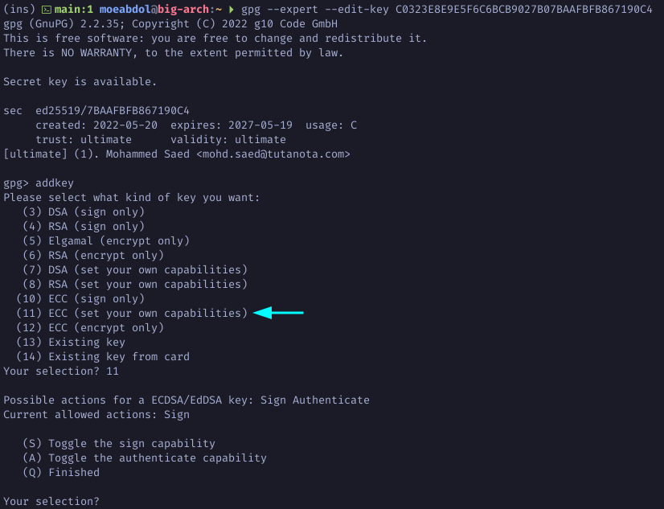

# How to Generate ED25519 GnuPG Keys

This is a step-by-step walkthrough of how to create ED25519 master key and
subkeys. The master key is labeld C Certify and the remaining subkeys are
labeled A,S,E Authenticate, Sign, and Encryption respectively. The E encryption
subkey is CV25519.

## Generate Master Key

1. Run gpg command with the following. Choose 11 to create a ED25519 key and set
   your own capabilities for each key.
```
$ gpg --full-gen-key --expert
```


2. Toggle off the sign capability to make sure the master key is certify only.


3. Choose q to finalize the capabilities then choose 1 for Curve 25519 and set
   the expiration of you master key. Enter your real name and password to set
   the `uid` user identity to this key.


4. Choose o for Okay then type in a strong password to protect the key, and
   voila your master key is created.


**Note:** Your master key has been created and using it now, you can create and
certify subkeys.
**Note:** Contrary to older versions, gpg now automatically creates a revokation
certificate for your keys.

## Generate Subkeys (Sign, Authenticate, and Encryption)

1. Run the following command to list your public keys. Copy your key id to be
   used in the next step.
```
$ gpg -k
```


2. Run the following to edit you master key and add subkeys. Type addkey to add
   a new subkey. Choose 11 to create an ED25519 subkey.
```
$ gpg --expert --edit-key YOUR-MASTER-KEY-ID
```



3. Make sure the Sign capability is on to create a sign subkey only. Choose 1
   for ED25519 subkey and define the expiration.


4. Note how the newly generated subkey is sign only.


5. Continue by creating another subkey with authenticate only capability.


6. Again choose 1 for Curve 25519. Define an expiration period and note how your
   new subkey is authenticate only.


7. For the last subkey type addkey and this time choose 12 to create an
   encryption only Curve 25519 subkey.


8. Define an expiration period and agree to the remaining questions.


9. Finaly, type in `save` to save all your newly generated subkeys. Now list
    all your keys.
```
$ gpg -k
```


## Export Your Public Key

Export your public key to a file that you can share with others or use with
Github, Gitlab, or other sites.
```
$ gpg --export --armor  --output .gnupg/public_key.gpg YOUR-MASTER-KEY-ID
```

## Publish Your Public Key to a Keyserver

In order to share your public key associated with your uid with others for
signing and/or encryption you can also publish your public key to a well-known
keyserver.

1. Create a `gpg.conf` file in your .gnupg and add a keyserver for example.
```
hkbs://keys.openpgp.org
```

2. Send your public key to the keyserver.
```
$ gpg --send-keys YOUR-MASTER-KEY-ID
```

3. Lastly, the keyserver will send a verification email to the email associated
   with the key. Verify your identity and now you can share your public key with
   others.

## Backup Your Keys

Once you generate all your keys, go ahead and backup `.gnupg` directory to a
secure USB drive. When that is done you should delete your Master Key's private
key and also the revokation certificate from your local copy of .gnupg in your
home directory. This is to ensure that no one can find out your private key or
use your revokation certificate to revoke your key.

1. Run the following to list your private keys along with the keygrip.
```
$ gpg -K --with-keygrip
```


2. Delete the private key associated with you Master's keygrip from .gnupg
directory in your home folder.
```
$ ls -al .gnupg/private-keys-v1.d/
```


3. Also delete the revokation certificate.


4. Note that when you delete your private key a `sec#` will appear next to your
   private key to indicate that the private key doesn't exist in your .gnupg
   directory.


5. Change your passphrase to a shorter one for everyday use. This is to ensure
   that the original passphrase is never compromised.
```
$ gpg --edit-key YOUR-MASTER-KEY-ID passwd
```
